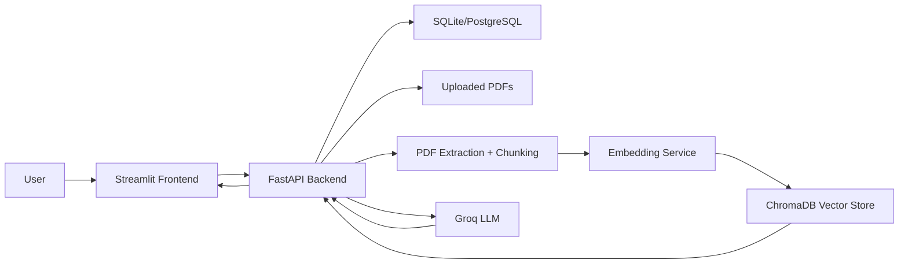
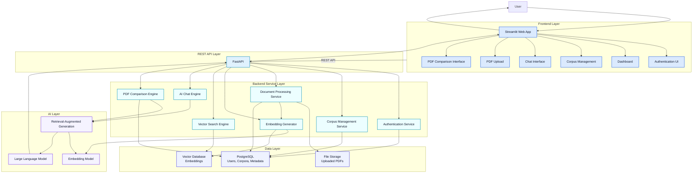
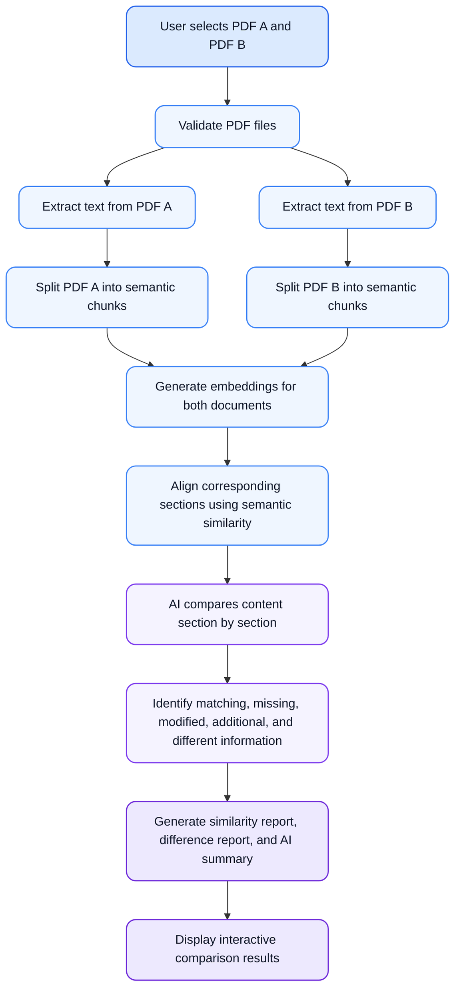
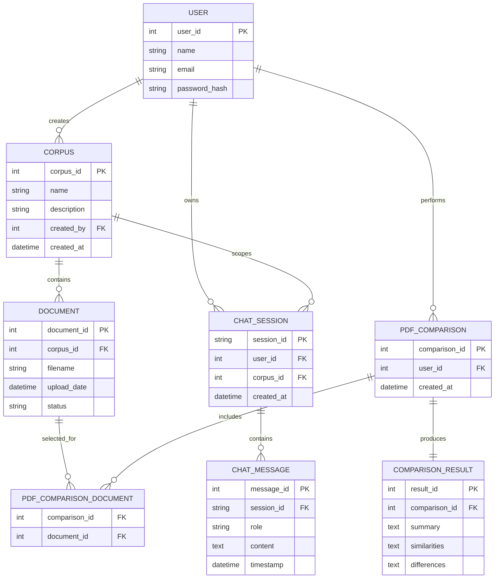

# Domain Knowledge Copilot

Domain Knowledge Copilot is a document intelligence application that allows authenticated users to create document workspaces, upload PDF files, ask grounded questions, inspect citations, review chat history, and compare multiple PDFs. The project is designed as an academic capstone submission for the New Age Software Engineering Program by iHUB DivyaSampark.

## Problem Statement

Students, researchers, and professionals often manage large collections of PDF documents. Finding precise information across those documents is time-consuming, and generic AI chat tools may answer without source grounding. This project addresses the need for a workspace-based assistant that retrieves relevant document sections before generating answers and exposes supporting evidence to the user.

## Objectives

- Provide secure user accounts with isolated document workspaces.
- Enable PDF upload, text extraction, chunking, embedding, and indexing.
- Support retrieval-augmented question answering over uploaded PDFs.
- Display page-level citations and expandable evidence.
- Preserve previous conversations for later access.
- Provide an advanced PDF comparison workflow for two or more documents.
- Keep the user interface approachable through a dark, professional productivity-style design.

## Key Features

- Email/password sign up and login.
- Persistent session restoration through a frontend auth cookie.
- Corpus dashboard with workspace creation, search, and summary metrics.
- PDF upload and indexing.
- Per-corpus chat with retrieved sources.
- Conversation history with corpus filtering and resume behavior.
- Multi-document PDF comparison.
- Comparison follow-up questions across selected documents.
- Evidence cards with document, page, section, similarity score, and relevant paragraph.
- Settings for user profile and interface preferences.

## System Overview

The application has a Streamlit frontend and a FastAPI backend. The backend stores relational data with SQLAlchemy, manages migrations with Alembic, stores PDF files on disk, stores vectors in ChromaDB, and uses Groq for LLM responses. Embeddings default to a deterministic hash-based backend, with optional Sentence Transformers support.



## Technology Stack

| Layer | Technology |
| --- | --- |
| Frontend | Streamlit, Requests, extra-streamlit-components |
| Backend | FastAPI, Uvicorn, Pydantic |
| Database | SQLAlchemy, Alembic, SQLite default, PostgreSQL supported |
| Authentication | Custom HMAC-signed JWT-style bearer token, PBKDF2 password hashing |
| PDF Processing | pypdf |
| Chunking | Character-based overlapping chunks |
| Embeddings | Hash embeddings by default; optional Sentence Transformers |
| Vector Database | ChromaDB persistent collections |
| LLM | Groq SDK, default model `llama-3.3-70b-versatile` |
| Deployment Config | `backend/render.yaml`; Railway-compatible environment variables |

## Architecture Overview

The backend follows a layered structure:

- API routes validate requests and enforce user ownership.
- CRUD modules perform database operations.
- Services encapsulate PDF extraction, chunking, embeddings, vector retrieval, LLM prompts, and comparison logic.
- SQLAlchemy models define relational persistence.
- Alembic migrations evolve the schema.

The frontend is a single Streamlit application with page-level render functions for dashboard, corpus detail, corpus chat, comparison, history, and settings.

## Project Diagrams

The following diagrams summarize the product workflow, system architecture, AI pipelines, and database design. They are written in Mermaid so they render directly on GitHub.

### User Workflow Diagram

```mermaid
flowchart TD
    Start([User opens web application])
    AuthChoice{"Has an account?"}
    Register["Sign Up"]
    Login["Login"]
    Dashboard["Open Dashboard"]
    CorpusChoice{"Create or select workspace?"}
    CreateCorpus["Create New Corpus"]
    SelectCorpus["Select Existing Corpus"]
    Upload["Upload one or more PDF documents"]
    Extract["Backend extracts PDF text"]
    Chunk["Split text into semantic chunks"]
    Embed["Generate embeddings"]
    Store["Store chunks in Vector Database"]
    Ask["Ask a question"]
    Retrieve["Retrieve relevant chunks with semantic search"]
    LLM["LLM generates grounded answer"]
    Answer["Display answer with source references"]
    Continue{"Ask another question?"}
    CompareChoice{"Compare PDFs?"}
    CompareUpload["Select two or more uploaded PDFs"]
    CompareAI["AI compares documents section by section"]
    CompareResult["Display similarities, differences, and summary"]
    End([Session complete])

    Start --> AuthChoice
    AuthChoice -->|"No"| Register --> Dashboard
    AuthChoice -->|"Yes"| Login --> Dashboard
    Dashboard --> CorpusChoice
    CorpusChoice -->|"Create"| CreateCorpus --> Upload
    CorpusChoice -->|"Select"| SelectCorpus --> Upload
    Upload --> Extract --> Chunk --> Embed --> Store
    Store --> Ask --> Retrieve --> LLM --> Answer
    Answer --> Continue
    Continue -->|"Yes"| Ask
    Continue -->|"No"| CompareChoice
    CompareChoice -->|"Yes"| CompareUpload --> CompareAI --> CompareResult --> End
    CompareChoice -->|"No"| End

    classDef startEnd fill:#dbeafe,stroke:#2563eb,color:#0f172a,stroke-width:2px;
    classDef process fill:#eff6ff,stroke:#3b82f6,color:#0f172a,stroke-width:1.5px,rx:12,ry:12;
    classDef decision fill:#f0f9ff,stroke:#0284c7,color:#0f172a,stroke-width:1.5px;
    classDef ai fill:#f5f3ff,stroke:#7c3aed,color:#0f172a,stroke-width:1.5px,rx:12,ry:12;

    class Start,End startEnd;
    class AuthChoice,CorpusChoice,Continue,CompareChoice decision;
    class LLM,CompareAI ai;
    class Register,Login,Dashboard,CreateCorpus,SelectCorpus,Upload,Extract,Chunk,Embed,Store,Ask,Retrieve,Answer,CompareUpload,CompareResult process;
```



### System Architecture Diagram



### AI-Powered PDF Comparison Workflow



### Retrieval-Augmented Generation Pipeline

```mermaid
flowchart LR
    subgraph Indexing["Indexing Pipeline"]
        PDF["PDF Documents"]
        Extract["Text Extraction"]
        Chunk["Text Chunking"]
        EmbedDocs["Embedding Generation"]
        VectorDB["Vector Database"]
    end

    subgraph Query["Question Answering Pipeline"]
        UserQuery["User Query"]
        QueryEmbed["Query Embedding"]
        Search["Similarity Search"]
        TopChunks["Top Relevant Chunks"]
        Context["Context + User Question"]
        LLM["Large Language Model"]
        Final["Final Answer with References"]
    end

    PDF --> Extract --> Chunk --> EmbedDocs --> VectorDB
    UserQuery --> QueryEmbed --> Search
    VectorDB --> Search
    Search --> TopChunks --> Context --> LLM --> Final

    classDef index fill:#dbeafe,stroke:#2563eb,color:#0f172a,stroke-width:1.5px,rx:12,ry:12;
    classDef query fill:#ecfeff,stroke:#0891b2,color:#0f172a,stroke-width:1.5px,rx:12,ry:12;
    classDef ai fill:#f5f3ff,stroke:#7c3aed,color:#0f172a,stroke-width:1.5px,rx:12,ry:12;
    classDef result fill:#ede9fe,stroke:#6d28d9,color:#0f172a,stroke-width:1.5px,rx:12,ry:12;

    class PDF,Extract,Chunk,EmbedDocs,VectorDB index;
    class UserQuery,QueryEmbed,Search,TopChunks,Context query;
    class LLM ai;
    class Final result;
```



### Database ER Diagram



## Installation

```bash
git clone <repository-url>
cd Domain-Knowledge-Copilot
python3 -m venv .venv
source .venv/bin/activate
python -m pip install --upgrade pip
pip install -r backend/requirements.txt
pip install -r frontend/requirements.txt
```

Sentence Transformers embeddings are optional. To enable them, install the ML extras and set `EMBEDDING_BACKEND=sentence-transformers`:

```bash
pip install -r backend/requirements-ml.txt
```

## Environment Variables

| Variable | Required | Default | Description |
| --- | --- | --- | --- |
| `DATABASE_URL` | No | Neon PostgreSQL URL | SQLAlchemy database URL. Railway should set this as an environment variable. |
| `GROQ_API_KEY` | Yes for LLM answers | None | API key for Groq completion requests. |
| `JWT_SECRET_KEY` | Yes in production | `development-only-change-me` | Secret used to sign tokens. |
| `EMBEDDING_BACKEND` | No | `hash` | Use `hash` or `sentence-transformers`. |
| `EMBEDDING_MODEL` | No | `all-MiniLM-L6-v2` | Sentence Transformer model name when enabled. |
| `BACKEND_URL` | Frontend | `http://localhost:8000` | Backend API base URL used by Streamlit. |
| `AUTH_COOKIE_SECURE` | Production recommended | false | Enables secure auth cookie behavior in HTTPS deployments. |
| `MAX_STORAGE_BYTES` | Frontend optional | 2 GB | Display limit for storage usage cards. |

## Running Backend

```bash
cd backend
export GROQ_API_KEY="your-groq-api-key"
export JWT_SECRET_KEY="replace-with-a-secure-secret"
uvicorn app.main:app --reload
```

The backend is available at `http://localhost:8000`.

## Running Frontend

```bash
cd frontend
export BACKEND_URL="http://localhost:8000"
streamlit run app.py
```

The frontend usually opens at `http://localhost:8501`.

## Database Setup

The backend runs migration logic during FastAPI startup. For manual migration:

```bash
cd backend
alembic upgrade head
```

Fresh databases are created from SQLAlchemy metadata and stamped at Alembic head. Existing databases are upgraded through Alembic. PostgreSQL startup uses an advisory lock to reduce concurrent migration conflicts.

## API Overview

Most endpoints require `Authorization: Bearer <access_token>`.

| Method | Endpoint | Purpose |
| --- | --- | --- |
| `GET` | `/health` | Health check |
| `POST` | `/auth/register` | Create account |
| `POST` | `/auth/login` | Login |
| `GET` | `/auth/me` | Return current user |
| `PATCH` | `/auth/profile` | Update display name |
| `GET` | `/corpora` | List user corpora |
| `POST` | `/corpora` | Create corpus |
| `DELETE` | `/corpora/{corpus_id}` | Delete corpus |
| `GET` | `/corpora/{corpus_id}/documents` | List documents and corpus metrics |
| `POST` | `/corpora/{corpus_id}/upload` | Upload and index PDF |
| `POST` | `/search` | Retrieve relevant chunks |
| `POST` | `/answer` | Generate grounded answer |
| `GET` | `/history` | Retrieve chat history |
| `POST` | `/comparisons` | Compare multiple documents |
| `GET` | `/comparisons` | List comparisons |
| `GET` | `/comparisons/{id}` | Get comparison details |
| `POST` | `/comparisons/{id}/ask` | Ask questions across compared documents |

## Folder Structure

```text
.
├── backend/
│   ├── alembic/              # Database migrations
│   ├── app/
│   │   ├── api/              # FastAPI routes and dependencies
│   │   ├── core/             # Config and security
│   │   ├── crud/             # Data access functions
│   │   ├── db/               # Engine, sessions, migration startup
│   │   ├── models/           # SQLAlchemy models
│   │   ├── schemas/          # Pydantic request/response models
│   │   └── services/         # PDF, chunking, embedding, vector, LLM, comparison
│   ├── render.yaml
│   └── requirements.txt
├── frontend/
│   ├── app.py                # Streamlit application
│   ├── styles.py             # Design system CSS and UI helpers
│   └── requirements.txt
└── docs/
```

## Screenshots

Add screenshots before submission:

- `screenshots/login.png`
- `screenshots/corpus-dashboard.png`
- `screenshots/corpus-detail.png`
- `screenshots/corpus-chat.png`
- `screenshots/compare-documents.png`
- `screenshots/chat-history.png`
- `screenshots/settings.png`

## Future Scope

- OCR support for scanned PDFs.
- Streaming LLM responses.
- Role-based team workspaces.
- Exportable chat and comparison reports.
- Dedicated evaluation dashboard for answer quality.
- Stronger semantic evaluation metrics.
- Object storage for uploaded files in production.
- Managed vector database deployment.

## Contributors

- Ayushman Rathi
- New Age Software Engineering Program by iHUB DivyaSampark

## License

Unable to determine from the repository. Add a `LICENSE` file before public release.

## Documentation Index

See [DOCUMENTATION_INDEX.md](DOCUMENTATION_INDEX.md) for the complete generated documentation package.
